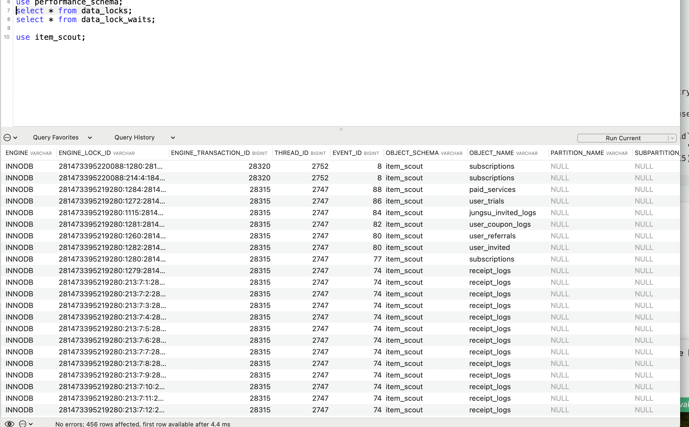

+++
title = 'Typeorm'
date = 2024-02-25T00:20:22+09:00
draft = true
+++

결국 테이블이 일부만 업데이트되는 것을 막기 위함.
은행만 필요한건 아님.
우리도 tracking product가 저장됐는데 detail_info가 저장되지 않으면 화면이 텅 비는 오류가 생김.
둘 다 저장되거나 둘 다 안되거나.
한쪽이 송금했으면 다른 한쪽이 받거나
둘다 실패하거나인 것 처럼.

### 트랜잭션 충돌 해결
어제 payment-api에서 트랜잭션 문제를 해결해서, 관련해서 공유드립니다~
@Transactional 등 트랜잭션 맥락에 있을 때는
아래 네번째 그림처럼
getEntityManager를 사용해서 해당 네임스페이스에 있는 엔터티매니저를 가지고 트랜잭션을 수행해야
트랜잭션이 중복생성되지 않는거 같습니다 !
( (isTransactionActive 로 여부 판단가능)
초대하기-구독해지 트랜잭션 에러  (이미지 순서대로)
초대하기가 @Transactional 트랜젝션으로 이미 래핑된 상태에서
구독/영수증 저장시 transaction 함수를 부르게되면 (saveSubscriptionAndReceiptLog)
트랜잭션이 충돌해서 ER_LOCK_WAIT_TIMEOUT 에러가 납니다.
3. Typeorm에선 하나의 트랜잭션에서 함수들을 실행한다고 하는데 실제로는 save 횟수만큼 트랜잭션이 실행되는거같아요.. 락 걸린 상태에서 select * from INNODB_LOCKS; 실행시 알수있는듯




#### Repository class vs EntityManager
💎 결국, 엔터티매니저로 직접 저장할거냐 (묶을 메소드들에 인자로 넘겨서)
레포지토리로 저장할거냐인데. (통째로 묶음. 다만 로우쿼리면 안될것같은 느낌은..?)
중요한 건 같은 실행 컨택스트에 있느냐는 것. (기준은? namespace ??)
- createQueryRunner('slave')는 slave 서버에 대한 새로운 QueryRunner를 생성함. 
커넥션이 다를 경우 기존에 시작된 트랜잭션 컨텍스트와 독립적으로 작동할 가능성이 있음..

Repository.save랑 
EntityManager.save랑 다름.
- this.getRepository()는 Repository -> IGenericRepository.save 메서드를 부르게 되는데. entity 목적어 하나면 됨.
  - Repository가 이미 특정 엔터티 타입 (Entity)에 바인딩되어 있기 때문에 추가적으로 엔터티 타입을 명시할 필요가 없음
- 그러나 트랜잭션 내 EntityManager의 save 메서드는 Entity 타입(Record)과 실제 엔터티를 둘 다 받음.
  - EntityManager는 데이터베이스 내의 모든 엔터티를 관리하는 더 일반적인 역할을 수행
  - EntityManager는 특정 엔터티 타입에 바인딩되지 않고, 다양한 타입의 엔터티를 관리할 수 있는 능력
  - 따라서 특정 엔터티 타입을 명시적으로 지정해줘야 함.

💎 insert raw query는 create queryrunner 필요없나본데

```typescript
await this.dataSource.transaction(async (tx) => {
    const scmEntity = await tx.save(
        ScmEntity,
        ScmMapper.toEntity(scm),
    );
// 참고로 알아서 롤백해줌. catch에서 따로 rollback 안해줘도.
// QueryRunner를 쓰면 직접 롤백 해줘야함.

save<Entity, T extends DeepPartial<Entity>>(targetOrEntity: EntityTarget<Entity>, entity: T, options?: SaveOptions):
```

---
### 트랜잭션 라이브러리
- 각 데이터 소스가 고유 식별자(이름)를 갖게 되고 트랜잭션 컨텍스트를 지원하기 위해 데이터 소스를 패치해야 하는지 여부를 결정할 수 있습니다.

```javascript
export declare const addTransactionalDataSource: (input: DataSource | AddTransactionalDataSourceInput) => DataSource;

export const addTransactionalDataSource = (input: AddTransactionalDataSourceInput | DataSource) => {
  if (isDataSource(input)) {
    input = { name: 'default', dataSource: input, patch: true };
  }

  const { name = 'default', dataSource, patch = true } = input;
  if (dataSources.has(name)) {
    throw new Error(`DataSource with name "${name}" has already added.`);
  }

  if (patch) {
    patchDataSource(dataSource);
  }

  dataSources.set(name, dataSource);
  // eslint-disable-next-line @typescript-eslint/ban-ts-comment
  // @ts-ignore
  dataSource[TYPEORM_DATA_SOURCE_NAME] = name;

  return input.dataSource;
};
```

- 

---
patchDataSource 함수는 TypeORM 데이터 소스 인스턴스를 수정하여 트랜잭션 컨텍스트에 통합
1. Manager Property 변경
-  getEntityManagerInContext: 현재 트랜젝션 컨텍스트에 바인딩된 Entity Manager를 가져온다. query, getRepository 하는 주체
- set : 원본 매니저를 new로 교체한다.
2. Query Method 변경
-  데이터 소스의 쿼리 메서드가 사용자 정의 함수로 대체
-  injects the current transaction's queryRunner into the arguments
3. Transaction Method Modification
트랜잭션 메서드는 원래 관리자의 트랜잭션 메서드에 위임하도록 직접 패치됩니다. 이렇게 하면 데이터소스를 통해 시작된 트랜잭션이 적절한 컨텍스트와 수명 주기로 관리됩니다.

```typescript
const patchDataSource = (dataSource: DataSource) => {
  let originalManager = dataSource.manager;

  Object.defineProperty(dataSource, 'manager', {
    configurable: true,
    get() {
      return (
        getEntityManagerInContext(this[TYPEORM_DATA_SOURCE_NAME] as DataSourceName) ||
        originalManager
      );
    },
    set(manager: EntityManager) {
      originalManager = manager;
    },
  });

  const originalQuery = DataSource.prototype.query;

  dataSource.query = function (...args: unknown[]) {
    args[2] = args[2] || this.manager?.queryRunner;
    return originalQuery.apply(this, args);
  };

  const originalCreateQueryBuilder = DataSource.prototype.createQueryBuilder;

  dataSource.createQueryBuilder = function (...args: unknown[]) {
    if (args.length === 0) {
      return originalCreateQueryBuilder.apply(this, [this.manager?.queryRunner]);
    }

    args[2] = args[2] || this.manager?.queryRunner;

    return originalCreateQueryBuilder.apply(this, args);
  };

  dataSource.transaction = function (...args: unknown[]) {
    // eslint-disable-next-line @typescript-eslint/ban-ts-comment
    // @ts-ignore
    return originalManager.transaction(...args);
  };
};

```


TypeORM 데이터 소스가 각 컨텍스트 호출마다 새로 생성되는 것은 아닙니다. 여기서의 핵심은 dataSourceFactory 함수 내에서 addTransactionalDataSource(new DataSource(options));를 호출하는 것입니다. 이 함수는 비동기적으로 데이터 소스를 생성하고, 이를 트랜잭셔널 컨텍스트 관리에 등록
- dataSourceFactory는 데이터 소스 인스턴스를 생성합니다. 이 때, new DataSource(options)를 사용하여 TypeORM의 DataSource 인스턴스를 초기화
- 트랜잭셔널 등록: 생성된 DataSource 인스턴스는 addTransactionalDataSource 함수를 통해 트랜잭셔널 컨텍스트에 등록됩니다. 이 과정에서 데이터 소스는 필요한 경우 수정(patching)되어 트랜잭션 관리가 가능한 상태로 조정됩니다.
- 싱글톤 패턴: TypeORM 설정이 글로벌 모듈 내에서 정의되며, dataSourceFactory는 애플리케이션 시작 시 한 번만 호출됩니다.
- 트랜잭션 스코핑: 트랜잭셔널 컨텍스트는 각각의 요청이나 작업에 대해 별도로 관리됩니다. addTransactionalDataSource에 의해 패치된 데이터 소스는 트랜잭션을 요청이나 작업별로 적절히 스코핑하여 처리할 수 있습니다. 그러나 이는 데이터 소스 인스턴스 자체를 새로 생성하는 것이 아니라, 트랜잭션 관리 방식을 조정하는 것입니다.

```typescript
@Global()
@Module({
    imports: [
        TypeOrmModule.forRootAsync({
            dataSourceFactory: async (options) => {
                return addTransactionalDataSource(new DataSource(options));
            },
            useClass: MysqlConfigProvider,
            inject: [PinoLogger],
        }),
    ],
```

### 직접구현 vs 라이브러리
💎 둘다 cls-hooked의 namespace를 사용해서 실행 컨텍스트를 유지하고 
이 네임스페이스를 통해 각 요청에 대한 트랜잭션 매니저(entity managner)에 접근할 수 있는건 같음.
- 그러나 직접 구현의 경우 메타데이터를 활용하지 않고 wrapping 함수에서 클로저로 외부변수 originalMethod에 접근하고 있음.
- 라이브러리 경우 네임스페이스를 내부적으로 관리하게 되어있음. >> 추상화. 직접 신경쓸 필요 없도록.

#### 직접 구현
- cls-hooked의 namespace를 활용하여 실행 컨텍스트를 유지합니다. 이 방식은 특정 컨텍스트(여기서는 요청이나 특정 실행 흐름) 내에서 EntityManager를 공유하고, 해당 EntityManager를 사용하여 트랜잭션을 관리


```typescript
export function Transactional() {
    // 실행될 메소드 (원본 메소드)
    const originalMethod = descriptor.value;
    // 원본 메소드를 트랜잭션으로 wrapping하는 메소드
    async function transactionWrapped(this: any, ...args: unknown[]) {
      const namespace = getNamespace(NamespaceKey.TRANSACTION);
      const entityManager = namespace.get(
        NamespaceKey.ENTITY_MANAGER,
      ) as EntityManager;
      return await entityManager.transaction(async (tx: EntityManager) => {
        namespace.set(NamespaceKey.ENTITY_MANAGER, tx);
        return await originalMethod.apply(this, args);
      });
    }
    // 원본 메소드를 트랜잭션으로 wrapping한 메소드로 교체
    descriptor.value = transactionWrapped;		
```


### Typeorm Transactional 라이브러리
- typeorm-transactional 라이브러리의 Transactional 데커레이터는 원본 메소드를 트랜잭션 로직으로 감싸면서도, 메타데이터와 메소드 이름을 정확하게 보존
- 원본 메소드는 wrapInTransaction 함수를 통해 수정되며, 이 함수 내에서 트랜잭션 관리 로직이 실행됩니다. 
> - 원본 메소드 보존: 이 과정에서 원본 메소드에 정의된 모든 메타데이터를 보존하기 위해, Reflect.getMetadataKeys를 사용하여 원본 메소드에 정의된 모든 메타데이터 키를 조회
> - 메타데이터 복사: 각 메타데이터 키에 대해, Reflect.getMetadata를 사용하여 원본 메소드에서 메타데이터 값을 검색하고, Reflect.defineMetadata를 사용하여 변경된 메소드에 동일한 메타데이터 값을 적용합니다. 이렇게 하여 메소드를 변경해도 원본 메소드에 적용된 메타데이터가 유실되지 않도록 합니다.


```typescript
export const Transactional = (options?: WrapInTransactionOptions): MethodDecorator => {
  return (
    _: unknown,
    methodName: string | symbol,
    descriptor: TypedPropertyDescriptor<unknown>,
  ) => {
    const originalMethod = descriptor.value as () => unknown;

    descriptor.value = wrapInTransaction(originalMethod, { ...options, name: methodName });

    Reflect.getMetadataKeys(originalMethod).forEach((previousMetadataKey) => {
      const previousMetadata = Reflect.getMetadata(previousMetadataKey, originalMethod);

      Reflect.defineMetadata(previousMetadataKey, previousMetadata, descriptor.value as object);
    });

    Object.defineProperty(descriptor.value, 'name', {
      value: originalMethod.name,
      writable: false,
    });
  };
};

```
